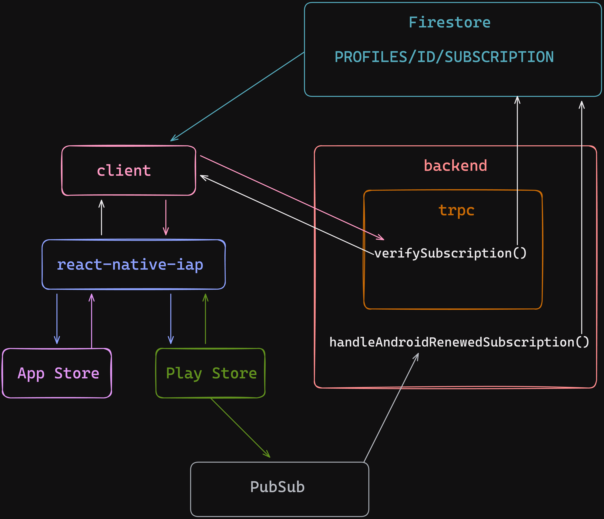

---
title: Reducing bundle size in React Native
date: 2023-09-19
---

When it comes to handling purchases in React Native app, we've got two options:
- outsourcing using e.g. [RevenueCat](https://www.revenuecat.com/),
- implementing it ourselves using [react-native-iap](https://react-native-iap.dooboolab.com/docs/get-started/)

The [react-native-iap](https://react-native-iap.dooboolab.com/docs/get-started/) library provides the interfaces for interacting with App Store and Play Store. It requires you to implement:
- verifying the receipt server-side,
- handling renewals and other events (like cancellation) of Android's subscriptions server-side using [Real-time developer notifications](https://developer.android.com/google/play/billing/rtdn-reference),
- handling events other than renewals of iOS's subscriptions server-side using [App Store Server Notifications](https://developer.apple.com/documentation/appstoreservernotifications)

#### Setting up App Store Server Notifications

> https://developer.apple.com/documentation/appstoreservernotifications/enabling_app_store_server_notifications

1. Deploy a function you want Apple to send notifications to.
2. Go to [App Store Connect](https://appstoreconnect.apple.com/)
3. Select your app
4. Click App Information in the sidebar
5. Scroll down to App Store Server Notifications

You can use [app-store-server-library-node](https://github.com/apple/app-store-server-library-node) to handle notifications.

#### Setting up Real-time developer notifications

> https://developer.android.com/google/play/billing/getting-ready#configure-rtdn

1. Create GCP project if you don't have one
2. Create topic
3. Create a Cloud Pub/Sub push subscription and grant publish rights
4. Add a function that Cloud Pub/Sub will send notifications into
5. Add topic name in Monetization setup in [Google Play Console](https://play.google.com/console/)

#### Example purchase flow

#### Testing renewals

RevenueCat has great articles how to test [android](https://www.revenuecat.com/blog/engineering/the-ultimate-guide-to-android-subscription-testing/) and [ios](https://www-origin.revenuecat.com/blog/engineering/the-ultimate-guide-to-subscription-testing-on-ios/#additional-testing-strategies) subscriptions.

To test few possible use cases in one run you can:
1. Buy 
2. Wait for the renewal 
3. Cancel 
4. Wait 5 minutes 
5. Restore 
6. Wait for the renewal
7. Refund