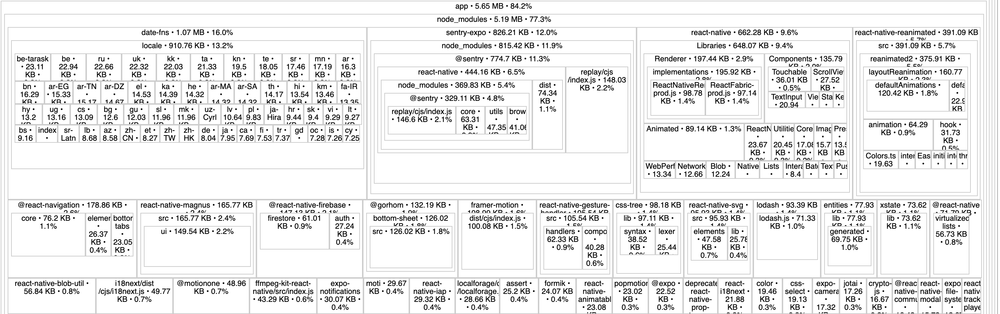

Developers with the web background starting with React Native can falsely assume that tree shaking is done automatically by the bundler, but it is not. See [this comment](https://github.com/facebook/metro/issues/227#issuecomment-583358386) or [this table](https://docs.expo.dev/guides/customizing-metro/#expo-webpack-versus-expo-metro).

Analyzing the bundle size can be done with [react-native-bundle-visualizer](https://github.com/IjzerenHein/react-native-bundle-visualizer)

Using the following command (with flag `--expo true` if you are using Expo):
```
npx react-native-bundle-visualizer
```
will result in something similar to the screenshot provided below:


We can argue that profits from reducing a few KB are not worth the time invested, but visualizing the bundle size reminds us to be more careful when choosing libraries we use. 

On the screenshot above, we can see that `date-fns` increases our bundle size by 1.07 MB, which should prompt us to consider other alternatives like [day.js](https://day.js.org/).

You can also decrease the bundle size of lodash by following [this article](https://medium.com/att-israel/how-to-shrink-tree-shake-lodash-in-bundle-file-for-react-native-90813a995dfa). 
Here are the scripts, that can help you do it a little bit faster:
- [listing used lodash functions](https://chat.openai.com/share/311322cb-06b8-4843-98d5-dd1e07b47727)
- [writing export statements](https://chat.openai.com/share/cb36ece0-c766-48bd-ae2b-c19350593468)

