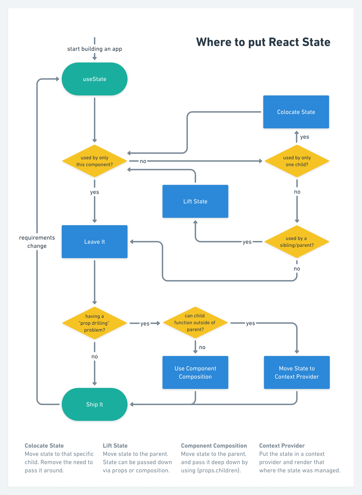

When it comes to handling the application state in React, I did better than good following the [Kent C. Dodds' advices](https://kentcdodds.com/blog/application-state-management-with-react), which boils down to:
**Keeping state as close to where it's needed as possible.**

Application state can be separated into two categories:
1. Client state - whatever your components need to work e.g form state, modals.
2. Server state - everything that comes from the server.

Usually, you will use different libraries to handle them.

### Client state


Taken from [state colocation article](https://kentcdodds.com/blog/state-colocation-will-make-your-react-app-faster#so-how-do-you-decide-where-to-put-state)

Personally, I would extend it by:
- using [useReducer](https://react.dev/reference/react/useReducer) or [Xstate](https://xstate.js.org/docs/) depending on the complexity of the business logic.
- using [jotai](https://jotai.org/) as global state library with `Provider` when applicable.

### Server state

There are different options depending on your stack, but generally I like using [Tanstack Query](https://tanstack.com/query/latest/). There is an excellent [blog](https://tkdodo.eu/blog/) explaining the concepts. One thing I like about that library is that `useQuery` hook accepts a promise. You can use it for different purposes, so the following example from Expo docs:
```
export default function App() {
  const [location, setLocation] = useState(null);
  const [errorMsg, setErrorMsg] = useState(null);

  useEffect(() => {
    (async () => {
      
      let { status } = await Location.requestForegroundPermissionsAsync();
      if (status !== 'granted') {
        setErrorMsg('Permission to access location was denied');
        return;
      }

      let location = await Location.getCurrentPositionAsync({});
      setLocation(location);
    })();
  }, []);
}
  ```
can be replaced with:
```
export default function App() {
  const { data, error } = useQuery(["location-permissions"], Location.requestForegroundPermissiosAsync);
  const { data: currentPosition, error: locationError } = useQuery(["current-position"], Location.gerCurrentPositionAsync);
}
 ```